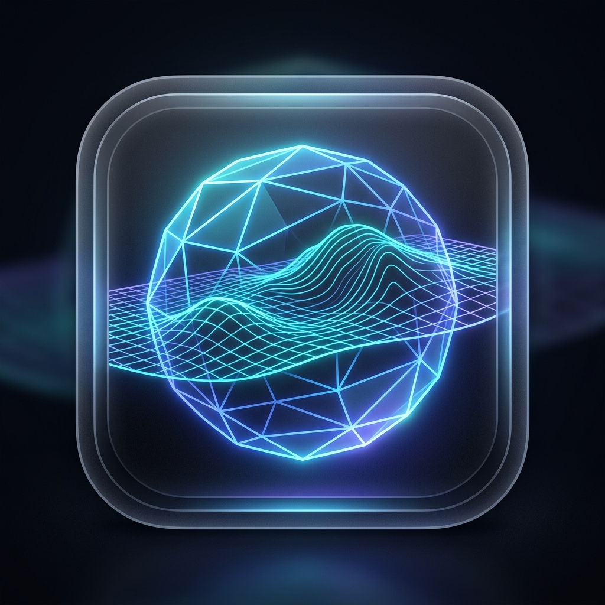
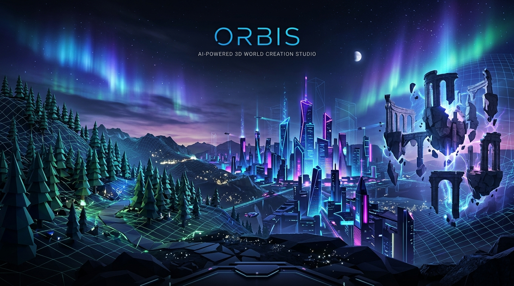
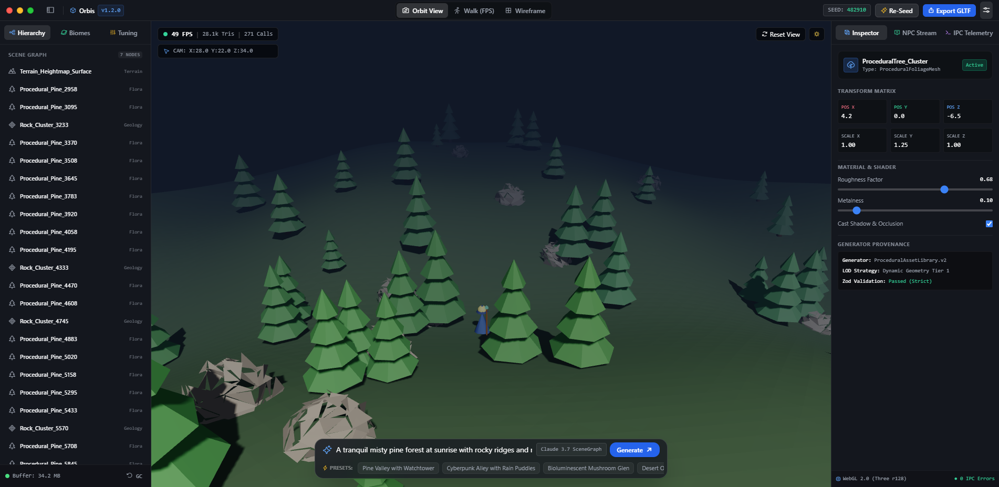
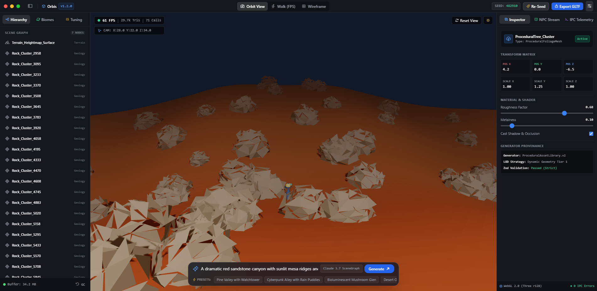
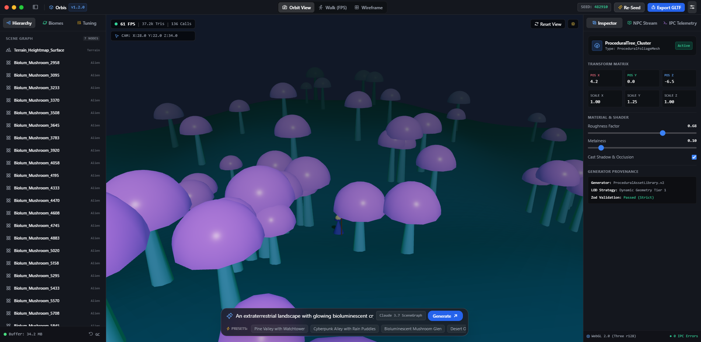
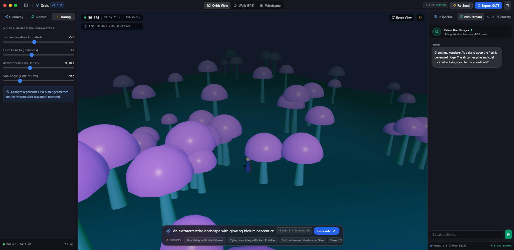
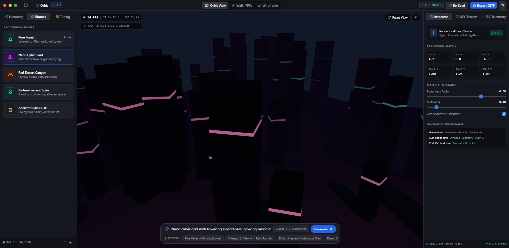

<div align="center">
  

  # Orbis

  **Describe a world. Walk through it.**

  [](LICENSE)
  [](https://electronjs.org)
  [](https://threejs.org)
  [](https://github.com/bitxwolf/worldof3js/releases/latest)

  
</div>

---

Orbis is an open-source desktop application that converts narrative text, images, and story documents into fully interactive, explorable **3D worlds** — powered by modern AI and [Three.js](https://threejs.org).

No coding. No 3D modelling. No game engine expertise required.

---

## ✨ What it does

You type (or upload) a description like:

> *"A foggy medieval village at dusk. Cobblestone streets, a blacksmith forge glowing orange, three NPCs going about their evening."*

Orbis builds it — live — as a walkable 3D world you can explore in first-person.

```
Your Story Description
        │
        ▼
  WorldParser (Claude AI)        ← text / image / PDF → structured scene JSON
        │
        ▼
  SceneCodegen (Claude AI)       ← scene JSON → Three.js code
        │
        ▼
  Validator (Zod schema)         ← checks correctness before rendering
        │
        ▼
  Three.js World Engine          ← walkable 3D environment with NPCs + events
```

---

## 🎮 Features

- **Text-to-3D World** — describe any world in plain language, get a walkable scene
- **Image input** — upload a reference image; the AI infers a matching 3D environment
- **Document parsing** — upload a PDF/doc of your story or lore; the engine extracts world data
- **Live updates** — type `"Add a ruined tower to the north"` and the world updates without a full rebuild
- **NPC system** — characters with AI-driven dialogue (powered by Claude)
- **First-person exploration** — WASD + mouse, crosshair HUD, interaction prompts
- **World library** — save and reload generated worlds
- **Inspector panel** — view the raw scene graph JSON for any generated world

---

## 📸 Screenshots

<table>
  <tr>
    <td align="center" width="50%">
      <br/>
      <sub><b>AI World Generation</b> — Pine forest with scene graph inspector</sub>
    </td>
    <td align="center" width="50%">
      <br/>
      <sub><b>Terrain Diversity</b> — Red desert canyon, procedurally generated</sub>
    </td>
  </tr>
  <tr>
    <td align="center" width="50%">
      <br/>
      <sub><b>Exotic Biomes</b> — Extraterrestrial bioluminescent landscape</sub>
    </td>
    <td align="center" width="50%">
      <br/>
      <sub><b>NPC System</b> — Live AI dialogue via the NPC Stream panel</sub>
    </td>
  </tr>
  <tr>
    <td align="center" colspan="2">
      <br/>
      <sub><b>Biome Browser</b> — Browse and switch between saved procedural worlds</sub>
    </td>
  </tr>
</table>

---

## 🏗️ Tech Stack

| Layer | Technology |
|---|---|
| Desktop shell | [Electron](https://electronjs.org) + [electron-vite](https://electron-vite.org) |
| UI | React 18 + TypeScript + Tailwind CSS |
| 3D engine | [Three.js](https://threejs.org) r160 |
| AI backend | Anthropic or OpenAI-compatible API (any good model) |
| State | [Zustand](https://github.com/pmndrs/zustand) |
| Validation | [Zod](https://zod.dev) |
| Build | [Vite](https://vitejs.dev) |
| Tests | [Vitest](https://vitest.dev) |

---

## 💾 Download Latest Release (Windows .exe)

To run Orbis immediately without setting up a development environment:

[](https://github.com/bitxwolf/worldof3js/releases/latest)

- 📥 **Direct Installer**: [WorldEngine-Setup-1.0.0.exe](https://github.com/bitxwolf/worldof3js/releases/download/v1/WorldEngine-Setup-1.0.0.exe)
- 🔗 **Releases Page**: [GitHub Releases v1.0.0](https://github.com/bitxwolf/worldof3js/releases/latest)

---

## 🚀 Quick Start (Development)

### Prerequisites

- **Node.js** 18+
- **An API key** — Anthropic or any OpenAI-compatible provider (e.g. [OpenRouter](https://openrouter.ai), Anthropic, OpenAI)

### Install & run from source

```bash
git clone https://github.com/bitxwolf/worldof3js.git
cd worldof3js
npm install
npm run dev
```

On first launch, click **Settings** to configure your API key. It is stored locally in encrypted `electron-store` and never shared.

### Build a distributable `.exe`

```bash
npm run build:win
```

Output is generated in `release/`.

---

## 🗺️ Roadmap

| Phase | Status | Goal |
|---|---|---|
| 0 — Scaffold | ✅ Done | Electron app, build pipeline, UI shell |
| 1 — LLM Brain | ✅ Done | Text → scene graph → validated JSON |
| 2 — World Engine | ✅ Done | Scene graph → walkable 3D world |
| 3 — Characters | ✅ Done | NPCs, AI dialogue, image-to-asset pipeline |
| 4 — Orbis Engine | ✅ Done | Events, triggers, document parsing, live world updates |
| 5 — Package & Ship | ✅ Done | Windows EXE, export, polish |

---

## 📐 Architecture

Orbis uses a clean **Electron main/renderer process split**:

- **Main process (Node.js)** — Claude API calls, file system, API key storage, image processing
- **Renderer process (Chromium + React)** — UI, Three.js engine, state management
- **Preload bridge** — secure `contextBridge` (no `nodeIntegration` in renderer)

---

## 🧪 Tests

```bash
npm test
```

Tests cover the event system, scene graph schema validation, and world store.

---

## 🤝 Contributing

Contributions are welcome! This project is in active development.

1. Fork the repo
2. Create a feature branch: `git checkout -b feat/your-feature`
3. Commit your changes
4. Open a Pull Request

---

## 📄 License

Apache 2.0 — see `LICENSE` file.

---

## 💡 Inspiration & Use Cases

| Who | How they use it |
|---|---|
| Fiction writers | Walk through their own world to check spatial coherence |
| Tabletop RPG creators | Interactive campaign map with live NPC conversations |
| Game designers (pre-production) | Rapid 3D world prototype before committing to Unity/Unreal |
| Educators | Interactive historical or fictional environments |

